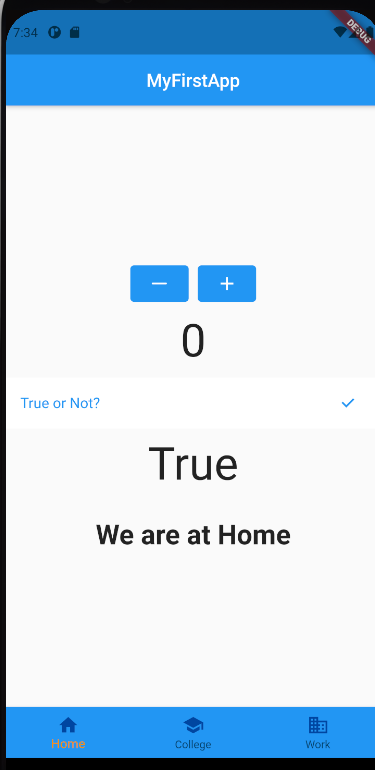

# Demonstration App 

This app is meant for explaining the usage of widgets.

To clone this repository and try out the app for yourself, use this link to clone the repository. 

```
https://github.com/SarthakM320/TSS_week1.git
```

or download a zip file from this link:-
```
https://github.com/SarthakM320/TSS_week1
```

Our basic app structure is this :- 



## 

Notice that we Have an app bar with the title 'My First App' at the center. (The default colour for any app bar is Blue)

So at first we create a stateful widget and in that we start with the Material app. Under that we will have the home property with the value as a Scaffold widget.
Under the scaffold we will have an app bar property with title.

```
MaterialApp(
  home: Scaffold(
    appBar: AppBar(
      title: Text('MyFirstApp'),
       centerTitle: true,
    )
  )
);
```

After this I declared some variables to be used inside the widgets like buttonCounter and a list of widgets to be used for displaying our options while using the BottomNavigationBar.

After this since we know that all our widgets are in a Column so we use a Column widget to display all other widgets except the navigation bar and we use the widgets accordingly with the required variables.

